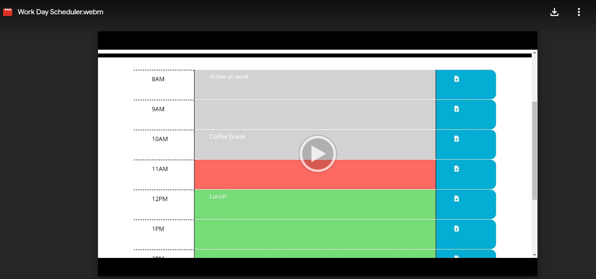

# Scheduler

[LINK TO APPLICATION](https://cjacktwil.github.io/scheduler/)

## Description

This scheduling application allows a user to enter a daily schedule in one-hour time blocks. 

## Functionality

When a user opens the application, a daily work schedule (8 a.m.-5 p.m.) appears. The user may add items to each one-hour time block by clicking on the box. After entering information, the user clicks on the save icon and the information is saved to localStorage. The schedule provides a visual reminder to the user by color-coding the time blocks. The future time blocks are green, current time blocks are red, and past time blocks are grey.
